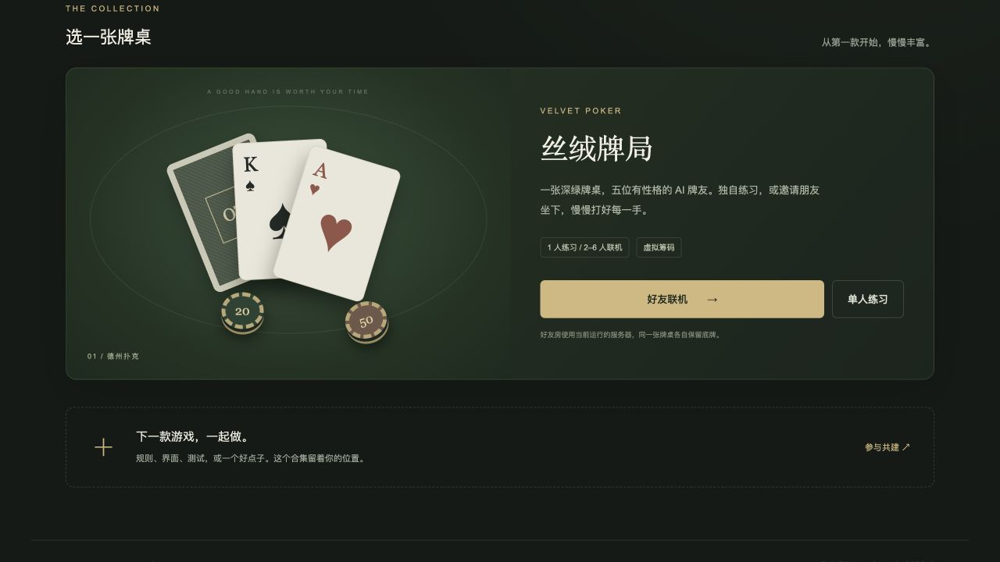

# Open Tabletop

[](https://github.com/DanTargaryen/open-tabletop/actions/workflows/ci.yml) [](LICENSE)

一个可以自己运行、继续扩展的开源网页桌游合集。**现已包含德州扑克与璀璨宝石·宝可梦特别款**：单人对战本地 AI，也可以创建房间与朋友联机。两款游戏的好友房都允许一个人直接开局，空位自动补 AI。

[English](README.en.md) · [添加游戏](docs/adding-a-game.md) · [架构说明](docs/architecture.md) · [参与贡献](CONTRIBUTING.md)



## 先玩一局

**[打开游戏大厅](https://velvet-poker-friends.linming-dracarys.chatgpt.site/)**，选择德州扑克或宝可梦，再选择单人模式或好友房。

[宝可梦特别款 · 单人冒险](https://velvet-poker-friends.linming-dracarys.chatgpt.site/games/splendor/) · [宝可梦特别款 · 好友联机](https://velvet-poker-friends.linming-dracarys.chatgpt.site/games/splendor/online) · [德州扑克试玩](https://velvet-poker-friends.linming-dracarys.chatgpt.site)

统一首页已部署到现有 Sites 域名；两款游戏均支持单人 AI 和远端好友房。原游戏直达路径及旧的扑克房间邀请链接继续可用。

德州扑克包含：

- 单人模式，以及可与朋友分享的联机房间。
- 豆包、ChatGPT、Claude、GLM、DeepSeek 主题 AI；它们使用本地策略，**不调用模型 API，也不需要 API Key**。
- 牌型判定、主池与边池结算，以及联机时的对手暗牌遮罩。
- 房间状态持久化、刷新恢复，以及按状态采用 1 / 2 / 5 秒间隔的轻量同步。
- 45 秒行动超时后自动过牌或弃牌；房间活动 TTL 为 24 小时。

品牌名称与标识的权利归原权利人所有，不代表品牌参与或背书，也不因本仓库的 MIT 许可而转让。详见 [第三方声明](THIRD_PARTY_NOTICES.md)。

## 璀璨宝石 · 宝可梦特别款

已发行宝可梦特别版规则的非官方实现：2–4 个座位、90 张卡、捕捉与进化、特殊卡和 18 分终局。支持单人本地 AI、好友准备开局、AI 补位、刷新恢复与独立房间存储。

卡表来自社区转录，尚未逐张核对实体版；55 种宝可梦均有本地角色图片，采用 The Artificial 作者自绘、允许署名分享的统一图标，无数字替补。详见 [玩法与运行](games/splendor/README.md) 及 [规则与素材来源](games/splendor/SOURCES.md)。宝可梦联机支持 Node 服务或 Cloudflare Workers + D1；Worker 需要应用独立的宝可梦房间与限流表迁移。

## 本地运行

需要 **Node.js 22.13 或更新版本**。项目没有 npm 依赖，无需先执行 `npm install`。

```sh
git clone https://github.com/DanTargaryen/open-tabletop.git
cd open-tabletop
npm start
```

打开 <http://127.0.0.1:18772>。

| 页面 | 地址 |
| --- | --- |
| 桌游目录 | `/` |
| 德州扑克单人模式 | `/games/texas-holdem/index.html` |
| 德州扑克联机模式 | `/games/texas-holdem/online.html` |
| 宝可梦特别款单人 AI | `/games/splendor/index.html` |
| 宝可梦特别款好友房 | `/games/splendor/online.html` |

与同一局域网内的朋友一起玩：

```sh
npm run lan
```

然后让朋友访问 `http://你的局域网地址:18772`。这个命令会监听 `0.0.0.0`；设备防火墙也需要允许访问对应端口。

## 运行配置

| 配置 | 命令行参数 | 环境变量 | 默认值 |
| --- | --- | --- | --- |
| 端口 | `--port` | `PORT` | `18772` |
| 运行数据目录 | `--data-dir` | `DATA_DIR` | `.data/` |
| 对外访问的来源地址 | `--origin` | `PUBLIC_ORIGIN` | 按请求确定 |

例如，在反向代理后运行：

```sh
npm start -- --port 18772 --data-dir /absolute/path/tabletop-data --origin https://tabletop.example.com
```

`--origin` 用于配置外部来源地址；它不会自动配置域名、TLS 或反向代理。公网部署还需要你自己的 HTTPS 入口。

运行数据可能包含房间状态与恢复身份，请保存在非公开目录中，不要提交到 Git，也不要放进静态站点。当前 Node 服务使用**单实例 JSON 持久化**，不能让多个进程共享同一份数据文件。

## 验证与部署

```sh
npm test
npm run build:static
```

测试覆盖两款游戏的规则引擎、房间逻辑、同步和根服务器。静态构建会将资源复制到 `.dist/public`；联机功能还需要提供 `/api/poker` 与 `/api/splendor` 的 Node 或 Worker + D1 后端，单独托管静态文件不能提供房间服务。

默认入口是 `server/index.mjs`，适合在自己的 Node 环境中运行。仓库也提供可选的 Cloudflare 适配器：

- `deploy/cloudflare/worker.mjs`
- `deploy/cloudflare/wrangler.example.jsonc`
- `deploy/cloudflare/migrations/`：扑克原有表与新增宝可梦表的顺序迁移；两款游戏使用独立表和限流。

示例配置中的数据库信息是占位符。使用前需要自行创建并绑定资源；本仓库不附带任何可复用的托管账户或数据库 ID。具体边界见 [架构说明](docs/architecture.md)。

## 扩展合集

每个游戏放在 `games/<game-id>/`，通过 `games/catalog.json` 出现在首页。当前目录包含 `texas-holdem` 与 `splendor`；未来游戏由实际实现和贡献逐步加入。

```text
games/
  catalog.json
  texas-holdem/
    web/        浏览器页面与资源
    server/     扑克规则与房间服务
    tests/      游戏测试
    scripts/    游戏开发工具
public/         合集首页
server/         Node 服务入口
deploy/         可选平台适配器
docs/           架构与扩展指南
```

欢迎修复问题、改善交互，或提交一款完整可玩的新游戏。请先读 [贡献指南](CONTRIBUTING.md) 和 [添加游戏指南](docs/adding-a-game.md)。安全问题请按 [安全说明](SECURITY.md) 私下报告。

## 许可

项目原创代码采用 [MIT License](LICENSE)。第三方名称、标识及其他素材以 [第三方声明](THIRD_PARTY_NOTICES.md) 所列权利与许可为准。
