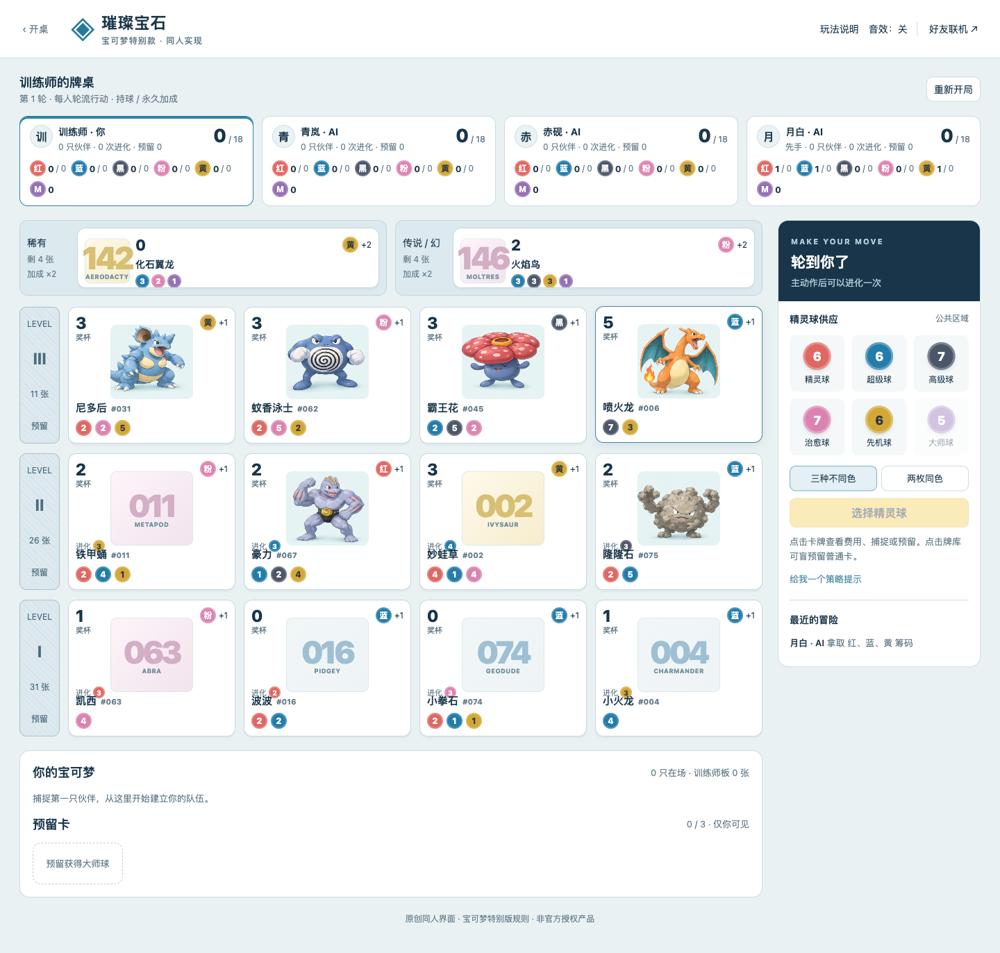
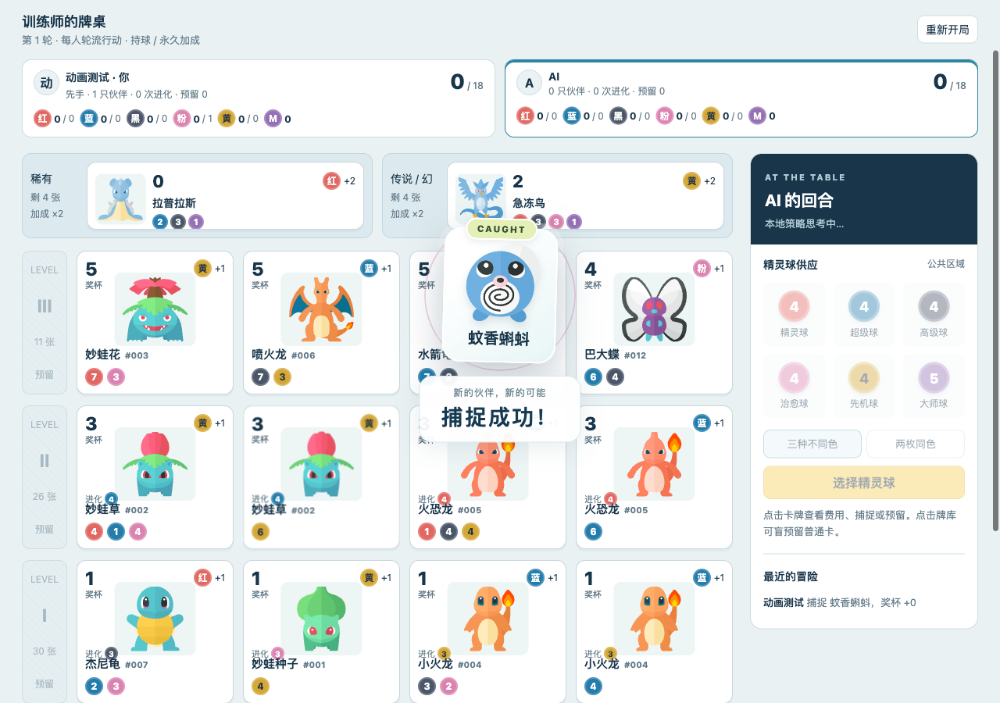

# 宝可梦特别版验证记录

验证日期：2026-09-10。适用范围：本次新增游戏及合集接入。规则与卡牌来源边界见 [SOURCES.md](../games/splendor/SOURCES.md)。

## 自动检查

`npm test`：127 项通过，0 失败、0 跳过。包括原扑克的 71 项回归与本次 56 项测试。执行环境为 macOS、Node 25.8.2；仓库 CI 的其他平台结果以对应提交的 Actions 为准。

新增规则测试覆盖人数配置、90 张卡的结构、拿取限制、预留与大师球、精确支付、归还、从市场和预留进化、旧卡失效、回合结束、18 分与三层平分规则。固定种子自动对局为 2／3／4 人各 12 局，共 36 局全部完成；每个决定后检查卡牌、精灵球、加成和分数守恒。

房间与真实 HTTP 测试覆盖身份隔离、隐私投影、版本冲突、并发提交、创建／加入／动作／退出重试、准备与权限、超时、房主转移、TTL、再开一局，以及 JSON 持久化后的服务重启恢复。API 输入大小和跨站来源也受到检查。

`npm run build:static`：通过。两款游戏的公开资源均进入 `.dist/public`；服务器、测试、日志、凭证和房间文件不进入静态输出。Cloudflare 对宝可梦 API 明确返回 503。

## 全图覆盖追加检查

全部 55 种角色使用 55 个不同的本地 SVG，覆盖 90 张卡。逐个验证文件存在、图鉴编号、SHA-256 与固定来源相符；SVG 不含脚本、外部图片、文字替补或事件处理器。浏览器实际加载 55/55 图片、全部 HTTP 200；市场 14 张展示卡、手机的两张特殊卡、预留卡和弹窗均显示角色图片。数字替补分支已删除。

## 浏览器检查

在本机 Node 服务上使用真实浏览器按钮操作，未用接口调用代替以下交互：

- 单人：开局、选择三色球、确认拿取、等待 AI 回应、盲预留、查看卡牌、刷新并恢复预留。
- 双身份：两个独立浏览器上下文创建／加入同一房间，双方准备、开始对局，一方盲预留、另一方拿球，比较两端展示卡一致，并验证预留内容隔离、刷新恢复和公开队伍查看。
- 弱网恢复：服务器处理动作后主动丢弃响应，浏览器自动发出同编号重试；两次请求只增加一张预留卡，刷新后保持一致。
- 1440×1000 桌面与 390×844 窄屏：页面没有横向溢出；卡牌分数与图鉴区不重叠；弹窗可操作。
- 原扑克页面加载，标题为 `VELVET POKER · 丝绒牌局`，未出现 JavaScript 页面错误。
- Notebook 页面、CSS 和 JS 均通过 GET 返回 HTTP 200；应用内标题、主标题与正文已渲染，控制台无错误或警告。

上述流程中未捕获到 JavaScript 页面错误。图片为使用本地测试对局生成的截图，不包含恢复令牌或真实房间记录。

[查看窄屏截图](pokemon-mobile-preview.png)

## 卡牌详情操作回归（2026-09-10）

修复详情容器的选中卡 ID 与卡牌点击标记冲突：捕捉、预留、关闭、支付折叠区的点击曾被误判为重新打开卡牌。选中状态改用独立属性，点击分发只处理实际按钮。

使用独立浏览器上下文及合法的蚊香蝌蚪支付测试局验证：关闭后弹窗保持关闭；支付调整可使捕捉按钮禁用／恢复；实际点击捕捉后扣除蓝球 2、黄球 1，获得卡牌 1 张和粉色永久加成 1；通过详情按钮预留成功；公开队伍卡牌仍能打开详情。全部操作无 JavaScript 页面错误。这是受控浏览器回归，不计为新增 Node 单元测试或整局真人对战。

## 获得反馈验证（2026-09-10）

新增 10 项纯状态事件测试：普通与免费捕捉、双加成特殊卡、进化净收益、预留不触发、首次加载／重复／过期快照不重播，以及隐藏信息不参与反馈。浏览器验证成功提示、卡牌飞入、加成高亮、动效不阻断点击、回放前后存档完全一致、刷新不重播。390px 手机与减少动态效果模式也通过显示与状态不变检查。另以受控服务器响应测试拒绝、650ms 延迟确认、重复轮询与重连：拒绝或确认前均无动效，确认后只播放一次；此项是客户端模拟响应测试，不冒充公网验证。

## 尚未完成的外部验证

这不是跨设备、跨局域网或异地公网实测；没有把宝可梦游戏部署到现有扑克线上站。牌库数值尚未逐张与实体盒核对。进化和终局边界由引擎测试覆盖，浏览器步骤记录不冒充一整局真人对战或竞技 AI 评测。

