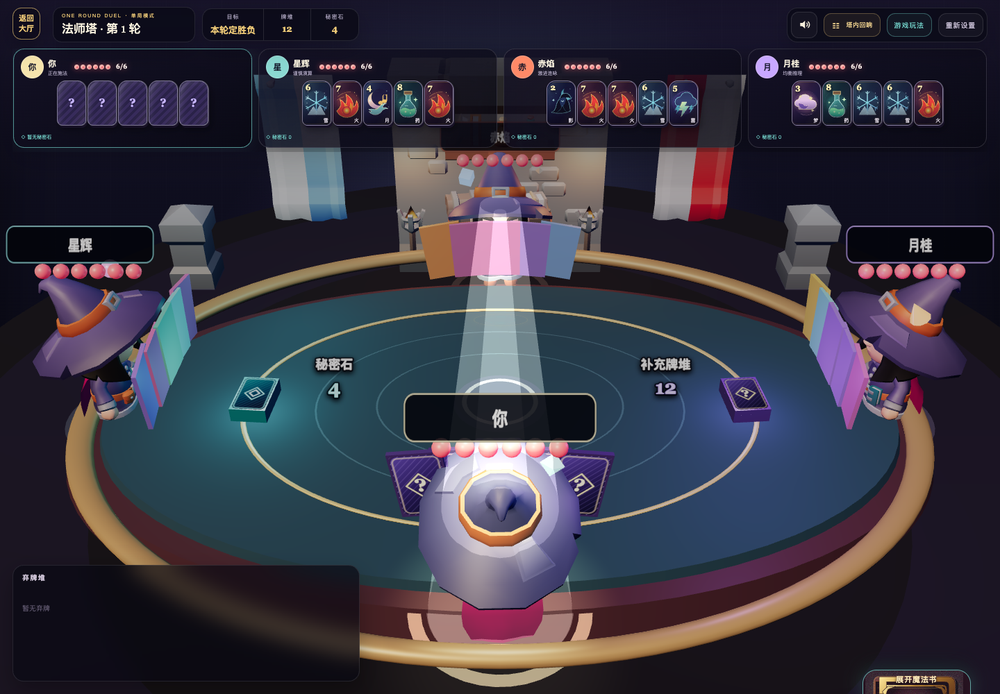
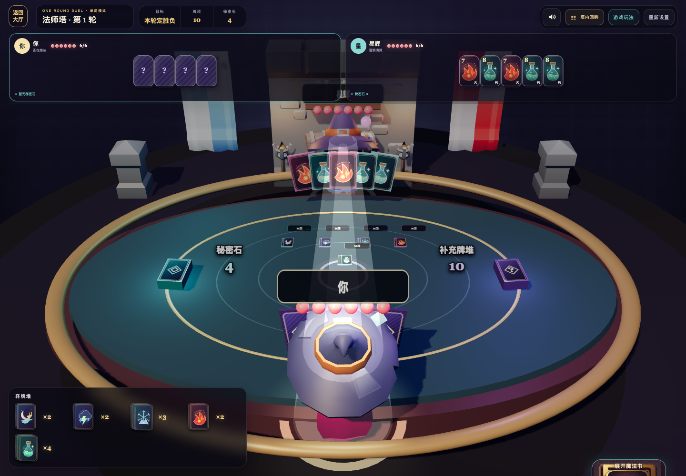
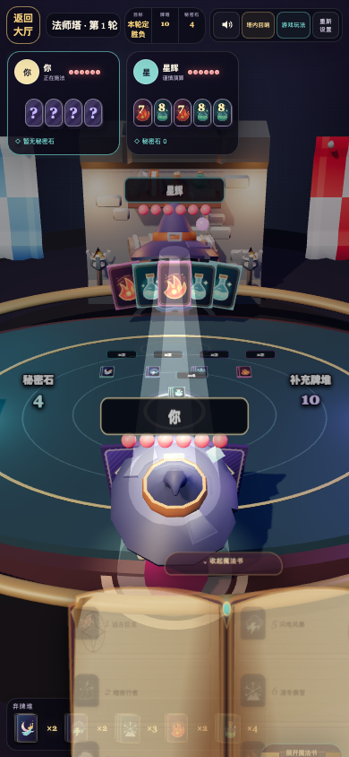
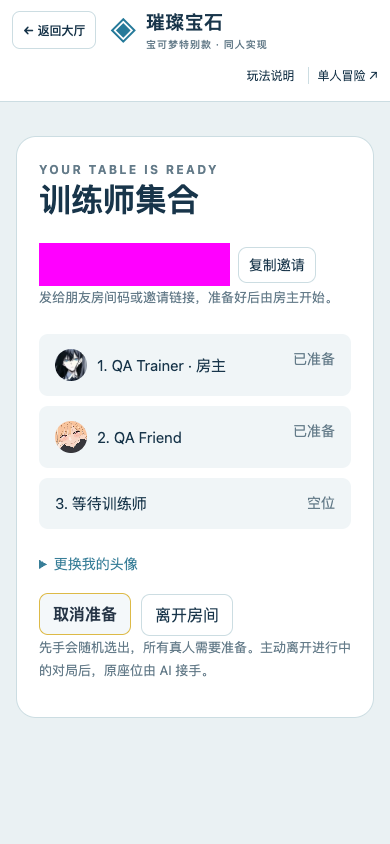

# 2026-09-13 可玩性验收：Abracada What / Splendor Pokémon

首页与两款游戏的单人、好友房正常流程均已用真实浏览器走通。本轮修复了出包魔法师的 **冷加载丢点击、3D 法术牌纹理缺失、临时断连后丢失恢复身份** 三个可复现问题；宝可梦未发现需要修改产品代码的阻塞问题。

验收基线为 `f6193bf`，本地与远端 `main` 一致。PR #1（Splendor Pokémon）与 #2（Abracada What）实际于 9 月 10 日合并；9 月 11 日合入魔法师 3D / 音效，9 月 12 日补充音效与返回大厅导航。本次覆盖这个完整集成版本。

## 修复与复现

| 问题 | 复现方法与旧行为 | 修复后的行为 |
| --- | --- | --- |
| 冷加载时第一下开局无效 | 延迟 `ui.js`；HTML 已显示可点击的「进入法师塔」，点击后放行脚本，页面仍停在设置。线上快速进入时也出现过；设置选择同样可能丢失。 | 单人设置与好友房输入、入口按钮等到初始化完成才启用；开局按钮先显示准备中的文字。 |
| 3D 法术牌只有纯色板 | 用 Chrome 开始单局，观察对手面前和桌面弃牌的 3D 卡面；原 SVG 只有 `viewBox`，纹理上传出现 `texSubImage2D: bad image data` / `Texture is immutable`。顶部 HTML 牌面正常。 | 八张 SVG 声明 240 × 336 固有尺寸，保持原有比例；3D 牌面正确显示，WebGL 警告消失。两个预览渲染器改用已安装 Three.js 支持的 `PCFShadowMap`。 |
| 刷新时短暂断连丢失席位 | 创建好友房后，让恢复 GET 返回一次 503，再恢复网络并刷新。旧代码删除 `abracada.room.v1`，原席位无法恢复。 | 保留恢复身份并显示恢复按钮；503、网络中断、非 JSON 的 503 响应后，均可重试回到同一席位。只有 401 / 403 / 404 明确失效响应才清除；403 已做浏览器回归。 |

断连测试只拦截测试浏览器请求，没有停止或修改线上服务。对基线 HTML / JS 和 SVG 的只读响应替换再次确认了上述旧行为。规则引擎、AI 策略、房间 API、存储和 D1 迁移没有改动。

## 真实浏览器验收矩阵

环境：macOS、Node.js 25.8.2、Google Chrome 152.0.7977.84；桌面 1440 × 1000、窄屏 390 × 844。先用应用内浏览器检查首页、单人交互及控制台，再用 Playwright 驱动独立 Chrome 完成可重复测试。应用内浏览器在原生返回确认框处发生自动化控制超时，确认/导航流程随后在 Chrome 中验证通过；这没有被计为游戏缺陷。

| 页面 / 流程 | 本地修复版 | 线上现有版 |
| --- | --- | --- |
| 首页 | 三款游戏、六个入口；桌面截图，页面身份正确 | 同样通过 |
| 宝可梦单人 | 开局、拿三色球、盲预留获得大师球、AI 接续、刷新恢复、返回大厅后重入；桌面和窄屏 | 开局、预留、AI 接续、刷新与重入通过 |
| 宝可梦好友房 | 创建 → 独立会话通过邀请房间码加入 → 双方准备 → 房主开局 → 第三席 AI 补位 → 客人刷新恢复 | 相同步骤通过真实线上 API |
| 魔法师单人 | 选择单局、开局、施法、隐藏自己的牌、返回确认；另在应用内验证成功连咏限制、收手与 AI 接续；桌面和窄屏 | 脚本加载完后可以开局施法；冷加载丢点击、3D 纹理问题已复现 |
| 魔法师好友房 | 创建 → 独立会话加入 → 准备 → 三席含 AI 开局 → 客人刷新恢复；双方自己的牌均隐藏 | 相同步骤通过真实线上 API，旧版纹理问题仍存在 |
| 异常恢复 | 503 / 请求中断 / 非 JSON 503 均保留同一身份并可恢复；403 清除失效身份 | 故障注入仅在本地执行 |
| 冷加载 | 阻塞单人和联机入口脚本期间，操作控件禁用；放行后启用 | 单人旧行为已观察到 |
| 控制台与资源 | 完整浏览器脚本无意外 JS、WebGL、资源错误或警告；故障测试的预期网络错误单独处理 | 首页和宝可梦无阻塞错误；魔法师 WebGL 警告已归因 |

线上核对地址：[游戏大厅](https://velvet-poker-friends.linming-dracarys.chatgpt.site/)、[宝可梦单人](https://velvet-poker-friends.linming-dracarys.chatgpt.site/games/splendor/)、[宝可梦好友房](https://velvet-poker-friends.linming-dracarys.chatgpt.site/games/splendor/online)、[魔法师单人](https://velvet-poker-friends.linming-dracarys.chatgpt.site/games/abracada-what/)、[魔法师好友房](https://velvet-poker-friends.linming-dracarys.chatgpt.site/games/abracada-what/online)。这些地址运行的是验收时的线上版本，**不代表本 PR 已部署**。

## 验证命令与复跑

- `npm test`：**206 / 206** 通过，包含规则、隐藏信息、房间、HTTP 和 Cloudflare 适配器测试。
- `npm run build:static`：通过。
- `git diff --check`：通过。
- `npm run test:browser`：**9 / 9 组**通过，包括两款游戏、两套独立会话、响应式截图与三个缺陷的回归；意外控制台问题为 **0**。

浏览器检查脚本为 [`scripts/check-browser-playability.mjs`](../../scripts/check-browser-playability.mjs)。它自建仅监听 `127.0.0.1` 的随机端口 Node 服务，使用临时房间目录，并在结束时关闭浏览器/服务、清理临时房间。它不会连接线上房间。截图和 JSON 结果默认写入忽略的 `.data/browser-qa/`；可用 `QA_EVIDENCE_DIR` 指定目录。

浏览器检查是可选开发工具，**没有新增生产或开发依赖，也未改锁文件**。需要环境中已有 Playwright 与其 Chromium，或已安装 Google Chrome。本次使用工具环境提供的 Playwright `1.63.0-alpha-2026-08-31` 和系统 Chrome。已有 Playwright 可被项目解析时直接运行：

```sh
npm run test:browser
```

若 Playwright 安装在项目外，指定其入口与已有 Chrome：

```sh
PLAYWRIGHT_MODULE=/absolute/path/to/playwright/index.mjs \
PLAYWRIGHT_CHANNEL=chrome \
npm run test:browser
```

可加 `QA_HEADED=1` 显示测试窗口。常规 CI 继续执行 `npm test` 和静态构建；本 PR 中的浏览器结果来自本机实际运行，不把常规 CI 当作浏览器验证。

## 验收边界

这次验证了可进入、可执行真实动作、AI 接续、双会话开局和身份恢复。**未在浏览器中完成宝可梦 18 分终局或魔法师 8 分积分赛全程**；未覆盖 Safari / Firefox、真实手机 GPU、跨地域弱网、长时间压力与断线恢复的全部组合。窄屏验收是桌面 Chrome 的视口模拟。

本 PR 提交修复与验收证据，尚未合并或部署。公开截图只有合成测试昵称，房间码已遮挡，不包含恢复令牌或房间数据文件。

## 截图

基线：3D 卡面变成纯色板（顶部 HTML 卡面正常）。



修复后：3D 对手手牌与桌面弃牌正确显示法术图案（不同测试对局）。



390 px 窄屏魔法书可展开并选择法术。



宝可梦独立客人会话已加入并准备，房间码遮挡。


