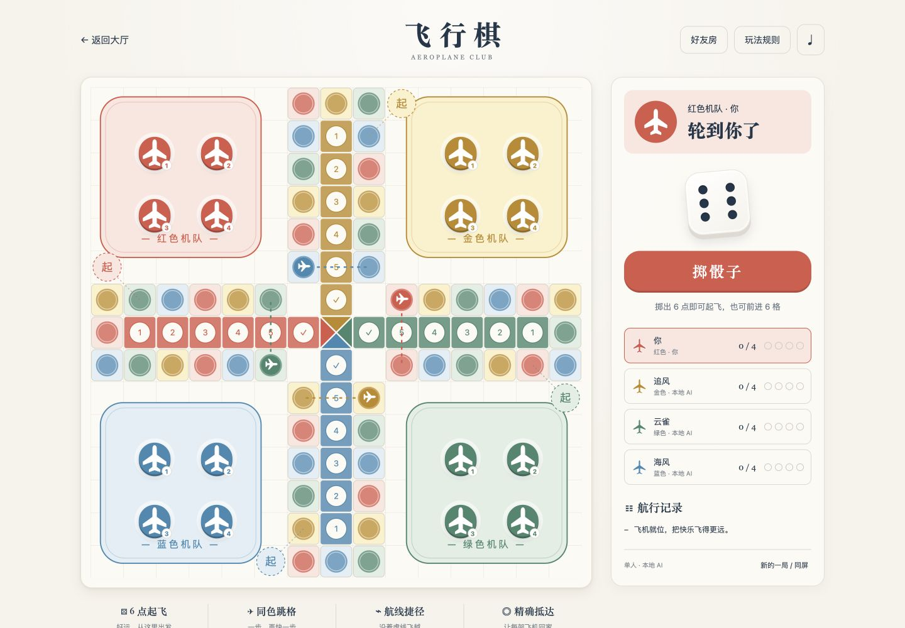
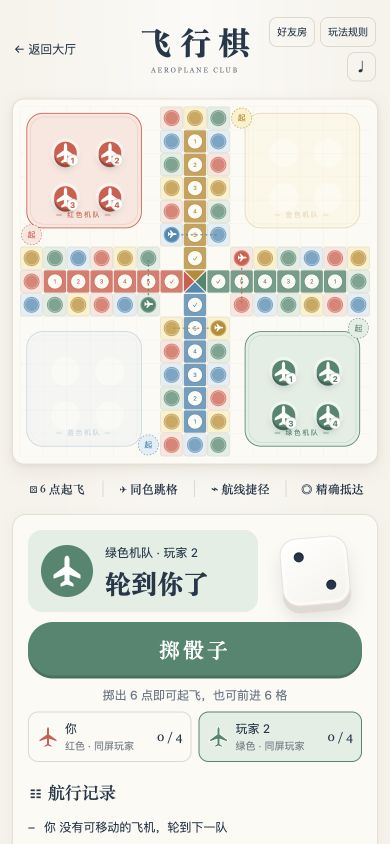

# 飞行棋 · Aeroplane Club

Open Tabletop 的四机竞速桌游。使用同一份纯规则引擎提供单人 AI、2–4 人同屏以及 1–4 人好友房。AI 为本地策略，不调用模型或外部服务。

## 运行

在仓库根目录执行 `npm install` 和 `npm start`，需要 Node.js ≥ 22.13。

- 单人 / 同屏：`http://127.0.0.1:18772/games/aeroplane-chess/index.html`
- 好友房：`http://127.0.0.1:18772/games/aeroplane-chess/online.html`
- 点击「新的一局 / 同屏」选择人数和同屏模式。
- 本地棋局自动保存，刷新继续；「玩法规则」提供全部规则。
- 好友房创建后分享六位房间码或邀请链接，朋友加入并准备，房主开始；空位自动填 AI。
- 返回大厅、持久化音效开关、减少动态效果偏好、键盘操作和移动端选机按钮均支持。

## 固定规则

1. 红色先手、顺时针轮转；2 人为红 / 绿对座，每支机队 4 架。
2. 只有掷出 6 才可把一架机场飞机放到独立起飞点；也可让已起飞飞机走 6 格。每次 6 都续掷，无三连六惩罚。
3. 每次只移动一架；没有合法移动则自动换人。
4. 走完骰子点数，落在本色环道格就跳 4 格，不无限连跳，也不跳过本色终点入口。
5. 直接走到虚线入口：飞越 12 格后跳 4 格；从前一同色格跳到入口：飞越 12 格后停止。
6. 骰子、跳格、飞越的每个落点都会撞回所有对方飞机；飞越还会撞回对角机队终点航道的虚线交叉点飞机。普通经过不撞。
7. 己方可以叠机，每次仍单独移动，不设路障。环道无安全格，独立起飞点不参与碰撞。
8. 走完 51 个环道位置后进入 6 格本色航道；到达终点必须点数恰好，超出则反弹。抵达的飞机放回机场并显示 ✓，不再移动。第一支 4 架全到的机队获胜。

飞行棋有多个地区规则版本，上述叠机和连六约定属于本合集的固定变体，见 [规则来源](SOURCES.md)。

## 联机与部署边界

Node 的 `/api/aeroplane` 独立使用运行数据目录中的 `aeroplane-rooms.json`，不得公开或提交数据。沿用仓库单实例文件存储，不能多进程共享一份文件。

每个掷骰 / 选机阶段限时 45 秒；超时由 AI 完成一步操作。AI 约每 1.1 秒一步，靠客户端请求推进。无人访问时不会在后台继续推进整局。离开房间后该队立即交给 AI；刷新恢复仍有效的身份。房间活动 TTL 24 小时。

客户端仅提交行动类型 / 飞机编号，服务端生成骰子、校验版本与回合，通过 revision CAS 防止并发覆盖，并按 requestId 去重。身份仅在请求头传递，存储中使用 SHA-256 摘要；公开棋盘不含凭证或内部请求记录。

Cloudflare Worker 适配器使用独立的 `aeroplane_rooms` 与 `aeroplane_limits`，需按顺序应用 `deploy/cloudflare/migrations/0004_aeroplane_rooms.sql`。Node 和 Worker 是不同部署路径。`npm run build:static` 包含本地玩法，好友房仍需后端。仓库接入不代表已发布到现有公共站点。

## 验证

```sh
node --test games/aeroplane-chess/tests/*.test.mjs
npm test
npm run build:static
```

测试包含确定性规则边界、100 局固定种子完整对局、AI 合法性、重复与并发请求、身份投影、超时、再开局、失效房间和真实 HTTP 重启恢复。根集成测试同时验证四款游戏的限流和独立 D1 迁移。浏览器操作还应覆盖起飞、掷骰、同屏切换、刷新、两个独立会话加入 / 准备 / 同步及 390px 窄屏。

## 结构

- `web/engine.js`：纯规则、公共棋盘坐标、AI 与存档校验。
- `web/board.js`：SVG 棋盘与可选飞机。
- `web/ui.js`：本地存档、好友房交互与同步。
- `web/audio.js`：合成音效、静音和历史事件去重。
- `server/rooms.mjs`：身份、权威行动、投影、超时及 CAS。
- `server/api.mjs`：Node / Worker 通用 HTTP 处理器与独立 D1 存储。

原创实现沿用仓库 MIT 许可，素材说明见 [SOURCES.md](SOURCES.md)。

## 界面




