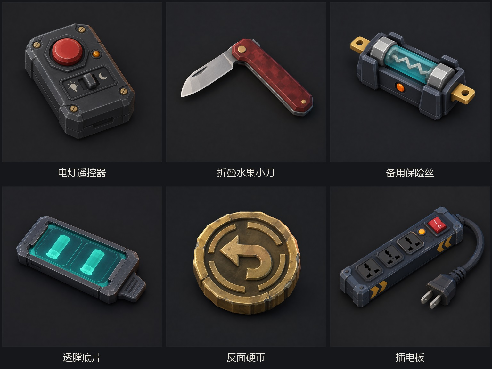

# 补偿道具：建模参考图（第一版）

生成模型：Right Code 接口的 `gpt-image-2`。日期：2026-09-18。

参考图：旧版普通道具总览 `output/imagegen/items-v1/items-overview-v1.jpg`。参考图仅用于匹配低多边形建模语言、棚拍视角、光照、材质和背景，没有把旧道具复制进新图。

这些图片用于后续制作《暗膛协议》的三维模型，不是可直接加载的 GLB/OBJ 模型。六件补偿道具分别生成，再由本地无损缩放和文字排版组成总览，避免多物体一次生成导致串形。

## 独立原图与实际提示词

- **电灯遥控器**：[原图](01-light-remote.png) · [实际提示词](01-light-remote-prompt.txt)
- **折叠水果小刀**：[原图](02-folding-fruit-knife.png) · [实际提示词](02-folding-fruit-knife-prompt.txt)
- **备用保险丝**：[原图](03-spare-fuse.png) · [实际提示词](03-spare-fuse-prompt.txt)
- **透膛底片**：[原图](04-bore-film.png) · [实际提示词](04-bore-film-prompt.txt)
- **反面硬币**：[原图](05-reverse-coin.png) · [实际提示词](05-reverse-coin-prompt.txt)
- **插电板**：[原图](06-power-strip.png) · [实际提示词](06-power-strip-prompt.txt)

独立原图均为 1254×1254 PNG；总览为 1536×1152 JPG。图中的中文名称由本地排版生成，不依赖图片模型写字。

## 三维制作拆件建议

### 电灯遥控器

- 主外壳、四枚黄铜螺钉、大红按钮、琥珀指示灯和昼夜拨杆分别建成独立子件。
- 大红按钮需要预留按下行程；昼夜拨杆需要预留左右滑动或摆动行程。
- 灯泡和月亮符号可使用简单浮雕几何或贴图，不需要高精度文字纹理。

### 折叠水果小刀

- 刀片、两侧红色握柄、金属内衬、黄铜轴钉和尾部固定钉分件。
- 刀片围绕轴钉旋转，至少需要“收起”和“完全打开”两个动画姿态。
- 参考图的刃口是视觉轮廓；实际低模不需要制作锋利到零厚度的边缘。

### 备用保险丝

- 深色底座、透明青色玻璃管、两端金属帽、内部折线熔丝、两侧黄铜端子和橙色指示灯分件。
- 玻璃管使用透明材质；内部熔丝需要从外部清楚可见。
- 触发动画可以把熔丝替换为断裂/发黑状态，并让橙色灯闪烁一次。

### 透膛底片

- 外部金属框、透明青色片材和右侧握持片分件。
- 两格弹壳影像应由动态贴图、发光平面或可切换图层实现，不要永久烘焙为固定的两颗同类子弹。
- 对手视角需要能够换成无内容的底片背面材质，避免泄露私密结果。

### 反面硬币

- 单一厚硬币主体即可；正反两面使用相同的回转箭头图案。
- 箭头和断裂圆环优先使用浅浮雕，确保桌面正常距离仍能辨认。
- 抛掷动画需要清楚表现厚度和边缘刻槽，但无需模拟真实货币细节。

### 插电板

- 插电板主体、三个插孔面板、红色总开关、琥珀指示灯、软线和双脚插头分件。
- 软线可以用低段数曲线或骨骼链；插头必须可单独抓取并执行拔出动画。
- 红色开关上的 `I/O` 属于常见电源符号。若后续希望完全无字符，可在材质制作时替换成纯凹槽和亮灭状态。
- 三个插孔不需要具备真实电气结构，只需保留从游戏镜头可辨认的凹槽轮廓。

## 共通建模约束

- 图中尺寸不代表游戏内相对尺寸；所有模型最终按手掌和补偿陷阱框统一缩放。
- 保留大轮廓、主要倒角和功能部件，省略细小划痕、微型接缝和无法从桌面镜头辨认的装饰。
- 每件道具以低至中等面数为目标，材质沿用现有暗色金属、旧塑料、黄铜和青色透明件语言。
- 模型原点、抓取点、桌面放置点与动画轴应在导出 GLB 前统一校验。
- 参考图没有展示背面；背面结构以动画和桌面稳定放置为优先，不必凭空增加复杂机械细节。
