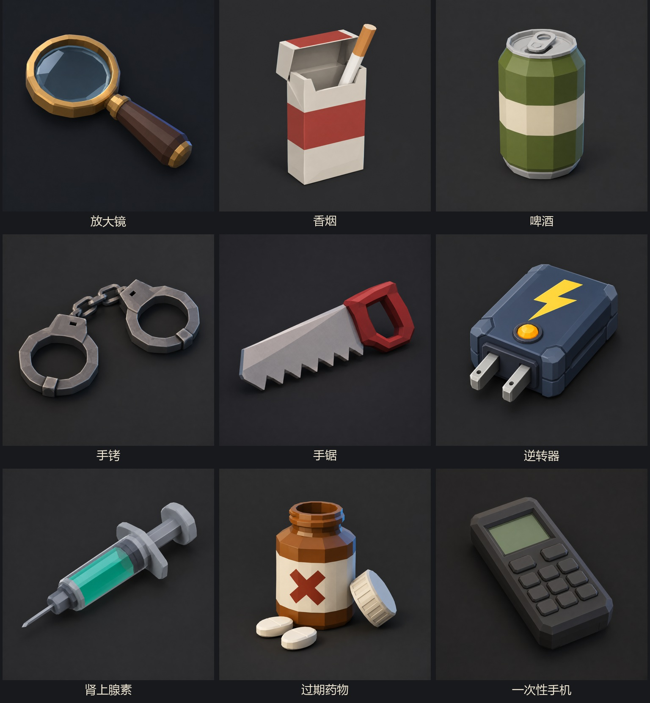
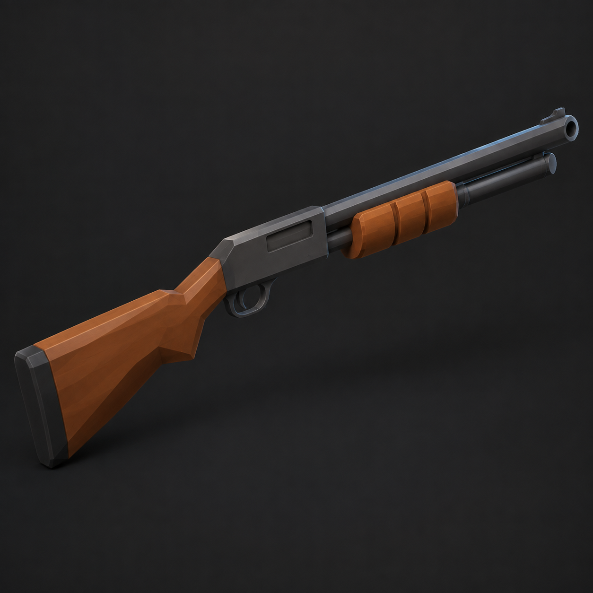

# 八种道具：精简建模参考图（第一版）

生成模型：Right Code 接口的 `gpt-image-2`。日期：2026-09-16。

这些是用于后续制作三维模型的生成参考图，不是可直接加载的 GLB/OBJ 模型。每种道具独立生成一张。

风格：低多边形、少零件、大色块、清晰轮廓、深灰背景。所有原图已逐一确认可读取，尺寸以保存文件为准。

## 独立原图与最终提示词

- **放大镜**：[原图](01-magnifier.png) · [实际提交的提示词](01-magnifier-prompt.txt)
- **香烟**：[原图](02-cigarette.png) · [实际提交的提示词](02-cigarette-prompt.txt)
- **啤酒**：[原图](03-beer.png) · [实际提交的提示词](03-beer-prompt.txt)
- **手铐**：[原图](04-cuffs.png) · [实际提交的提示词](04-cuffs-prompt.txt)
- **手锯**：[原图](05-saw.png) · [实际提交的提示词](05-saw-prompt.txt)
- **肾上腺素**：[原图](07-adrenaline.png) · [实际提交的提示词](07-adrenaline-prompt.txt)
- **过期药物**：[原图](08-expired-medicine.png) · [实际提交的提示词](08-expired-medicine-prompt.txt)
- **一次性手机**：[原图](09-burner-phone.png) · [实际提交的提示词](09-burner-phone-prompt.txt)

## 后续三维制作注意事项

- 按轮廓和主要配色建模；图中的微小磨损、倒角可以进一步省略。
- 香烟、药瓶盖、药片和注射器活塞等需要操作的零件应拆为独立子件。
- 放大镜镜片与注射器针筒需要真正的透明材质。
- 手机依靠按键屏幕与其他道具区分。
- 图中展示尺寸不代表游戏内相对尺寸；制作时按手掌、桌面槽位统一缩放。
- 图片不能验证网格面数、背面结构或绑定，制作三维资产时另行检查。

## 霰弹枪建模参考图

同样由 Right Code `gpt-image-2` 生成。采用精简木托泵动霰弹枪轮廓，木质枪托和前护木、深色金属机匣、完整枪管。此图为视觉参考，不是已完成的三维网格；尚未替换游戏中的枪。

[原图](10-shotgun.png) · [实际提交的提示词](10-shotgun-prompt.txt)

